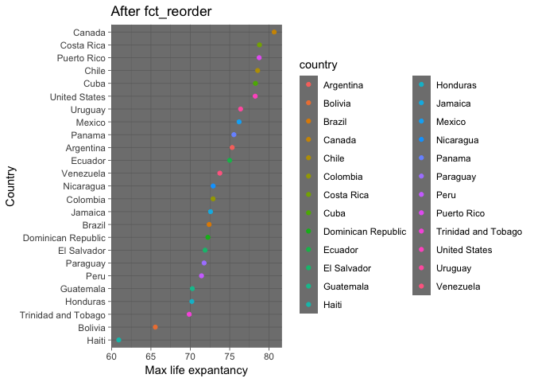

## Introduction
This is the first assignment of STAT 547M (despite it being named Homework 06).

First, let's load the used data

```r
suppressPackageStartupMessages(library(gapminder))
suppressPackageStartupMessages(library(tidyverse))
suppressPackageStartupMessages(library(stringr))
suppressPackageStartupMessages(library(testthat))
suppressPackageStartupMessages(library(stringi))
suppressPackageStartupMessages(library(ggplot2))
```


## 1.Character data
### 14.2.5 Exercises
####Q1
In code that doesn’t use stringr, you’ll often see paste() and paste0(). What’s the difference between the two functions? 
Answer: paste() allows us to add an separator between strings while paste0() dose not. Here is an example:

```r
paste("Task", "1", sep = "-")
```

```
## [1] "Task-1"
```

```r
paste0("Task", "1")
```

```
## [1] "Task1"
```

What stringr function are they equivalent to? How do the functions differ in their handling of NA?
Answer: paste() and paste0() equivalent to str_c(). Here is an example:

```r
str_c("Task", "1", sep = "-") 
```

```
## [1] "Task-1"
```

```r
str_c("Task", "1", sep = "")
```

```
## [1] "Task1"
```

How do the functions differ in their handling of NA?
Answer: NA is converted to a string "NA" in paste() and paste0(). However, if NA is one of the input strings for str_c(), the output of str_c() will be NA. Here is an example:

```r
paste("Look ", NA, sep = "")
```

```
## [1] "Look NA"
```

```r
paste0("Look ", NA)
```

```
## [1] "Look NA"
```

```r
str_c("Look ", NA)
```

```
## [1] NA
```

####Q2
In your own words, describe the difference between the sep and collapse arguments to str_c().
Answer:"sep" is used to seperate a vector of strings and keep the vector format. While "collapse" to a vector of strings into a single string. Here is an example:

```r
str_c(c("x", "y", "z"), c("a", "b", "c"), sep = ": ")
```

```
## [1] "x: a" "y: b" "z: c"
```

```r
str_c(c("x", "y", "z"), c("a", "b", "c"), collapse = ":")
```

```
## [1] "xa:yb:zc"
```

####Q3
Use str_length() and str_sub() to extract the middle character from a string. What will you do if the string has an even number of characters?
Answer:First, we need to use str_length to obtain the middle index. Then use str_sub to output the middle character. Here is the example:

```r
odd_string <- "eye"

# A function to find the middle index
find_middle <- function(input) {
  return(str_length(input) / 2 + 1)
}

# Obtain the middle index and output the midelle character
odd_index <- find_middle(odd_string) 
str_sub(odd_string, odd_index, odd_index)
```

```
## [1] "y"
```

What will you do if the string has an even number of characters?
Answer: We need to modify the str_sub. Because there are two middle characters now. Here is an modified example:

```r
even_string <- "eyne"

# A function to find the middle index
find_middle_even <- function(input) {
  return(str_length(input) / 2 + 1 )
}

# Obtain the middle index and output the midelle character
even_index <- find_middle_even(even_string) 
str_sub(even_string, even_index-1, even_index)
```

```
## [1] "yn"
```


####Q4
What does str_wrap() do? When might you want to use it?
Answer: str_wrap() tries to implement the Knuth-Plass paragraph wrapping algorithm. It might be used when we need to sperate a long paragraph into multiple lines. Here is an example:

```r
# a long sentence 
paragraph <- "One or more elements are missing or sketchy. Missed opportunities to complement code and numbers with a figure and interpretation. Technical problem that is relatively easy to fix. It’s hard to find the report in this crazy repo."

# view without wrap
cat(paragraph)
```

```
## One or more elements are missing or sketchy. Missed opportunities to complement code and numbers with a figure and interpretation. Technical problem that is relatively easy to fix. It’s hard to find the report in this crazy repo.
```

```r
# view with wrap
cat(str_wrap(paragraph), sep = "\n")
```

```
## One or more elements are missing or sketchy. Missed opportunities to complement
## code and numbers with a figure and interpretation. Technical problem that is
## relatively easy to fix. It’s hard to find the report in this crazy repo.
```

####Q5
What does str_trim() do? 
Answer: str_trim() removes whitespace from start and end of string. 

```r
# before removing whitespace from start and end of string
spaces_string = "  I am  "
spaces_string
```

```
## [1] "  I am  "
```

```r
# After using str_trim() 
no_spaces_string <- str_trim(spaces_string)
no_spaces_string
```

```
## [1] "I am"
```

What’s the opposite of str_trim()?
Answer: The opposite is str_pad() which is used to add whitespace. Here is an example to combine neighborhood character of letters.

```r
letters %>%
  .[1:10] %>% 
  str_pad(width = 2, side = "right") %>%
  str_c(letters[2:11])
```

```
##  [1] "a b" "b c" "c d" "d e" "e f" "f g" "g h" "h i" "i j" "j k"
```

Write a function that turns (e.g.) a vector c("a", "b", "c") into the string a, b, and c. Think carefully about what it should do if given a vector of length 0, 1, or 2.

```r
vector_to_string <- function(v) {
  if (length(v) == 0){
    return("")
  }
  else if (length(v) == 1){
    return(v)
  }
  else{
    front <- str_c(v[-length(v)], collapse = ", ")
    whole <- str_c(front, v[length(v)], sep = " and ")
    return(whole)
  }
}

#begin to test
vector_to_string(c(""))
```

```
## [1] ""
```

```r
vector_to_string(c("a"))
```

```
## [1] "a"
```

```r
vector_to_string(c("a", "b"))
```

```
## [1] "a and b"
```

```r
vector_to_string(c("a", "b","c"))
```

```
## [1] "a, b and c"
```

### 14.3.1.1 Exercises
#### Q1
Explain why each of these strings don’t match a \: "\", "\\", "\\\"?

symbol | Definition
----------------|------------------
   `\`      |  used as an escape character in regular expressions
   `\\`     | trated as a symbol "\"
   `\\\`    | a back slash + an escape character
   
Here is an example:

```r
test <- "I\\AM"
str_view(test, pattern = "\\\\", match = TRUE)
```

<!--html_preserve--><div id="htmlwidget-617c8c98c807db9f2ba1" style="width:960px;height:100%;" class="str_view html-widget"></div>
<script type="application/json" data-for="htmlwidget-617c8c98c807db9f2ba1">{"x":{"html":"<ul>\n  <li>I<span class='match'>\\<\/span>AM<\/li>\n<\/ul>"},"evals":[],"jsHooks":[]}</script><!--/html_preserve-->

####Q2
How would you match the sequence "'\?
Answer: Both ' and \ need to be escaped in regex.

```r
test <- "\"'\\AM"
test
```

```
## [1] "\"'\\AM"
```

```r
str_view(test, pattern = "\"\\'\\\\", match = TRUE)
```

<!--html_preserve--><div id="htmlwidget-17c6b817616e85d59981" style="width:960px;height:100%;" class="str_view html-widget"></div>
<script type="application/json" data-for="htmlwidget-17c6b817616e85d59981">{"x":{"html":"<ul>\n  <li><span class='match'>\"'\\<\/span>AM<\/li>\n<\/ul>"},"evals":[],"jsHooks":[]}</script><!--/html_preserve-->

####Q3
What patterns will the regular expression \..\..\.. match? How would you represent it as a string?
Answer: It match ".anycharacter.anycharacter.anycharacter"

```r
test <- "I.A.M.z...xxx"

str_view(test, pattern = "\\..\\..\\..", match = TRUE)
```

<!--html_preserve--><div id="htmlwidget-e7664ac65c0ca2b113cb" style="width:960px;height:100%;" class="str_view html-widget"></div>
<script type="application/json" data-for="htmlwidget-e7664ac65c0ca2b113cb">{"x":{"html":"<ul>\n  <li>I<span class='match'>.A.M.z<\/span>...xxx<\/li>\n<\/ul>"},"evals":[],"jsHooks":[]}</script><!--/html_preserve-->

### 14.3.2.1 Exercises
####Q1
How would you match the literal string "$^$"?
Answer: Both $ and ^ need to be escaped in regex.

```r
test <- "$^$, $$sssa"
str_view(test, pattern = "\\$\\^\\ $", match = TRUE)
```

<!--html_preserve--><div id="htmlwidget-7591043040ed43bbb02f" style="width:960px;height:100%;" class="str_view html-widget"></div>
<script type="application/json" data-for="htmlwidget-7591043040ed43bbb02f">{"x":{"html":"<ul>\n  <li><\/li>\n<\/ul>"},"evals":[],"jsHooks":[]}</script><!--/html_preserve-->

####Q2
Given the corpus of common words in stringr::words, create regular expressions that find all words that:

Start with “y”.

```r
str_view(stringr::words, pattern = "^y", match = TRUE)
```

<!--html_preserve--><div id="htmlwidget-b71accef11de9ee5ee90" style="width:960px;height:100%;" class="str_view html-widget"></div>
<script type="application/json" data-for="htmlwidget-b71accef11de9ee5ee90">{"x":{"html":"<ul>\n  <li><span class='match'>y<\/span>ear<\/li>\n  <li><span class='match'>y<\/span>es<\/li>\n  <li><span class='match'>y<\/span>esterday<\/li>\n  <li><span class='match'>y<\/span>et<\/li>\n  <li><span class='match'>y<\/span>ou<\/li>\n  <li><span class='match'>y<\/span>oung<\/li>\n<\/ul>"},"evals":[],"jsHooks":[]}</script><!--/html_preserve-->

End with “x”.

```r
str_view(stringr::words, pattern = "x$", match = TRUE)
```

<!--html_preserve--><div id="htmlwidget-a646146132e843bd3caa" style="width:960px;height:100%;" class="str_view html-widget"></div>
<script type="application/json" data-for="htmlwidget-a646146132e843bd3caa">{"x":{"html":"<ul>\n  <li>bo<span class='match'>x<\/span><\/li>\n  <li>se<span class='match'>x<\/span><\/li>\n  <li>si<span class='match'>x<\/span><\/li>\n  <li>ta<span class='match'>x<\/span><\/li>\n<\/ul>"},"evals":[],"jsHooks":[]}</script><!--/html_preserve-->

Are exactly three letters long. (Don’t cheat by using str_length()!)

```r
#There are too many matched words
#let's narrow down the search range to the head 20 words
str_view(stringr::words[1:20], pattern = "^.{3}$", match = TRUE)
```

<!--html_preserve--><div id="htmlwidget-9a61e1e5a7832be7c102" style="width:960px;height:100%;" class="str_view html-widget"></div>
<script type="application/json" data-for="htmlwidget-9a61e1e5a7832be7c102">{"x":{"html":"<ul>\n  <li><span class='match'>act<\/span><\/li>\n  <li><span class='match'>add<\/span><\/li>\n<\/ul>"},"evals":[],"jsHooks":[]}</script><!--/html_preserve-->

Have seven letters or more.

```r
#There are too many matched words
#let's narrow down the search range to the head 20 words
str_view(stringr::words[1:20], pattern = "^.{7,}$", match = TRUE)
```

<!--html_preserve--><div id="htmlwidget-2ec19f826de4024716e0" style="width:960px;height:100%;" class="str_view html-widget"></div>
<script type="application/json" data-for="htmlwidget-2ec19f826de4024716e0">{"x":{"html":"<ul>\n  <li><span class='match'>absolute<\/span><\/li>\n  <li><span class='match'>account<\/span><\/li>\n  <li><span class='match'>achieve<\/span><\/li>\n  <li><span class='match'>address<\/span><\/li>\n  <li><span class='match'>advertise<\/span><\/li>\n  <li><span class='match'>afternoon<\/span><\/li>\n<\/ul>"},"evals":[],"jsHooks":[]}</script><!--/html_preserve-->

### 14.3.3.1 Exercises
#### Q1
Create regular expressions to find all words that:

Start with a vowel.

```r
str_view(stringr::words, pattern = "^[aeiou]|[AEIOU]", match = TRUE)
```

<!--html_preserve--><div id="htmlwidget-b85d2665cc94c09cb7fb" style="width:960px;height:100%;" class="str_view html-widget"></div>
<script type="application/json" data-for="htmlwidget-b85d2665cc94c09cb7fb">{"x":{"html":"<ul>\n  <li><span class='match'>a<\/span><\/li>\n  <li><span class='match'>a<\/span>ble<\/li>\n  <li><span class='match'>a<\/span>bout<\/li>\n  <li><span class='match'>a<\/span>bsolute<\/li>\n  <li><span class='match'>a<\/span>ccept<\/li>\n  <li><span class='match'>a<\/span>ccount<\/li>\n  <li><span class='match'>a<\/span>chieve<\/li>\n  <li><span class='match'>a<\/span>cross<\/li>\n  <li><span class='match'>a<\/span>ct<\/li>\n  <li><span class='match'>a<\/span>ctive<\/li>\n  <li><span class='match'>a<\/span>ctual<\/li>\n  <li><span class='match'>a<\/span>dd<\/li>\n  <li><span class='match'>a<\/span>ddress<\/li>\n  <li><span class='match'>a<\/span>dmit<\/li>\n  <li><span class='match'>a<\/span>dvertise<\/li>\n  <li><span class='match'>a<\/span>ffect<\/li>\n  <li><span class='match'>a<\/span>fford<\/li>\n  <li><span class='match'>a<\/span>fter<\/li>\n  <li><span class='match'>a<\/span>fternoon<\/li>\n  <li><span class='match'>a<\/span>gain<\/li>\n  <li><span class='match'>a<\/span>gainst<\/li>\n  <li><span class='match'>a<\/span>ge<\/li>\n  <li><span class='match'>a<\/span>gent<\/li>\n  <li><span class='match'>a<\/span>go<\/li>\n  <li><span class='match'>a<\/span>gree<\/li>\n  <li><span class='match'>a<\/span>ir<\/li>\n  <li><span class='match'>a<\/span>ll<\/li>\n  <li><span class='match'>a<\/span>llow<\/li>\n  <li><span class='match'>a<\/span>lmost<\/li>\n  <li><span class='match'>a<\/span>long<\/li>\n  <li><span class='match'>a<\/span>lready<\/li>\n  <li><span class='match'>a<\/span>lright<\/li>\n  <li><span class='match'>a<\/span>lso<\/li>\n  <li><span class='match'>a<\/span>lthough<\/li>\n  <li><span class='match'>a<\/span>lways<\/li>\n  <li><span class='match'>a<\/span>merica<\/li>\n  <li><span class='match'>a<\/span>mount<\/li>\n  <li><span class='match'>a<\/span>nd<\/li>\n  <li><span class='match'>a<\/span>nother<\/li>\n  <li><span class='match'>a<\/span>nswer<\/li>\n  <li><span class='match'>a<\/span>ny<\/li>\n  <li><span class='match'>a<\/span>part<\/li>\n  <li><span class='match'>a<\/span>pparent<\/li>\n  <li><span class='match'>a<\/span>ppear<\/li>\n  <li><span class='match'>a<\/span>pply<\/li>\n  <li><span class='match'>a<\/span>ppoint<\/li>\n  <li><span class='match'>a<\/span>pproach<\/li>\n  <li><span class='match'>a<\/span>ppropriate<\/li>\n  <li><span class='match'>a<\/span>rea<\/li>\n  <li><span class='match'>a<\/span>rgue<\/li>\n  <li><span class='match'>a<\/span>rm<\/li>\n  <li><span class='match'>a<\/span>round<\/li>\n  <li><span class='match'>a<\/span>rrange<\/li>\n  <li><span class='match'>a<\/span>rt<\/li>\n  <li><span class='match'>a<\/span>s<\/li>\n  <li><span class='match'>a<\/span>sk<\/li>\n  <li><span class='match'>a<\/span>ssociate<\/li>\n  <li><span class='match'>a<\/span>ssume<\/li>\n  <li><span class='match'>a<\/span>t<\/li>\n  <li><span class='match'>a<\/span>ttend<\/li>\n  <li><span class='match'>a<\/span>uthority<\/li>\n  <li><span class='match'>a<\/span>vailable<\/li>\n  <li><span class='match'>a<\/span>ware<\/li>\n  <li><span class='match'>a<\/span>way<\/li>\n  <li><span class='match'>a<\/span>wful<\/li>\n  <li><span class='match'>e<\/span>ach<\/li>\n  <li><span class='match'>e<\/span>arly<\/li>\n  <li><span class='match'>e<\/span>ast<\/li>\n  <li><span class='match'>e<\/span>asy<\/li>\n  <li><span class='match'>e<\/span>at<\/li>\n  <li><span class='match'>e<\/span>conomy<\/li>\n  <li><span class='match'>e<\/span>ducate<\/li>\n  <li><span class='match'>e<\/span>ffect<\/li>\n  <li><span class='match'>e<\/span>gg<\/li>\n  <li><span class='match'>e<\/span>ight<\/li>\n  <li><span class='match'>e<\/span>ither<\/li>\n  <li><span class='match'>e<\/span>lect<\/li>\n  <li><span class='match'>e<\/span>lectric<\/li>\n  <li><span class='match'>e<\/span>leven<\/li>\n  <li><span class='match'>e<\/span>lse<\/li>\n  <li><span class='match'>e<\/span>mploy<\/li>\n  <li><span class='match'>e<\/span>ncourage<\/li>\n  <li><span class='match'>e<\/span>nd<\/li>\n  <li><span class='match'>e<\/span>ngine<\/li>\n  <li><span class='match'>e<\/span>nglish<\/li>\n  <li><span class='match'>e<\/span>njoy<\/li>\n  <li><span class='match'>e<\/span>nough<\/li>\n  <li><span class='match'>e<\/span>nter<\/li>\n  <li><span class='match'>e<\/span>nvironment<\/li>\n  <li><span class='match'>e<\/span>qual<\/li>\n  <li><span class='match'>e<\/span>special<\/li>\n  <li><span class='match'>e<\/span>urope<\/li>\n  <li><span class='match'>e<\/span>ven<\/li>\n  <li><span class='match'>e<\/span>vening<\/li>\n  <li><span class='match'>e<\/span>ver<\/li>\n  <li><span class='match'>e<\/span>very<\/li>\n  <li><span class='match'>e<\/span>vidence<\/li>\n  <li><span class='match'>e<\/span>xact<\/li>\n  <li><span class='match'>e<\/span>xample<\/li>\n  <li><span class='match'>e<\/span>xcept<\/li>\n  <li><span class='match'>e<\/span>xcuse<\/li>\n  <li><span class='match'>e<\/span>xercise<\/li>\n  <li><span class='match'>e<\/span>xist<\/li>\n  <li><span class='match'>e<\/span>xpect<\/li>\n  <li><span class='match'>e<\/span>xpense<\/li>\n  <li><span class='match'>e<\/span>xperience<\/li>\n  <li><span class='match'>e<\/span>xplain<\/li>\n  <li><span class='match'>e<\/span>xpress<\/li>\n  <li><span class='match'>e<\/span>xtra<\/li>\n  <li><span class='match'>e<\/span>ye<\/li>\n  <li><span class='match'>i<\/span>dea<\/li>\n  <li><span class='match'>i<\/span>dentify<\/li>\n  <li><span class='match'>i<\/span>f<\/li>\n  <li><span class='match'>i<\/span>magine<\/li>\n  <li><span class='match'>i<\/span>mportant<\/li>\n  <li><span class='match'>i<\/span>mprove<\/li>\n  <li><span class='match'>i<\/span>n<\/li>\n  <li><span class='match'>i<\/span>nclude<\/li>\n  <li><span class='match'>i<\/span>ncome<\/li>\n  <li><span class='match'>i<\/span>ncrease<\/li>\n  <li><span class='match'>i<\/span>ndeed<\/li>\n  <li><span class='match'>i<\/span>ndividual<\/li>\n  <li><span class='match'>i<\/span>ndustry<\/li>\n  <li><span class='match'>i<\/span>nform<\/li>\n  <li><span class='match'>i<\/span>nside<\/li>\n  <li><span class='match'>i<\/span>nstead<\/li>\n  <li><span class='match'>i<\/span>nsure<\/li>\n  <li><span class='match'>i<\/span>nterest<\/li>\n  <li><span class='match'>i<\/span>nto<\/li>\n  <li><span class='match'>i<\/span>ntroduce<\/li>\n  <li><span class='match'>i<\/span>nvest<\/li>\n  <li><span class='match'>i<\/span>nvolve<\/li>\n  <li><span class='match'>i<\/span>ssue<\/li>\n  <li><span class='match'>i<\/span>t<\/li>\n  <li><span class='match'>i<\/span>tem<\/li>\n  <li><span class='match'>o<\/span>bvious<\/li>\n  <li><span class='match'>o<\/span>ccasion<\/li>\n  <li><span class='match'>o<\/span>dd<\/li>\n  <li><span class='match'>o<\/span>f<\/li>\n  <li><span class='match'>o<\/span>ff<\/li>\n  <li><span class='match'>o<\/span>ffer<\/li>\n  <li><span class='match'>o<\/span>ffice<\/li>\n  <li><span class='match'>o<\/span>ften<\/li>\n  <li><span class='match'>o<\/span>kay<\/li>\n  <li><span class='match'>o<\/span>ld<\/li>\n  <li><span class='match'>o<\/span>n<\/li>\n  <li><span class='match'>o<\/span>nce<\/li>\n  <li><span class='match'>o<\/span>ne<\/li>\n  <li><span class='match'>o<\/span>nly<\/li>\n  <li><span class='match'>o<\/span>pen<\/li>\n  <li><span class='match'>o<\/span>perate<\/li>\n  <li><span class='match'>o<\/span>pportunity<\/li>\n  <li><span class='match'>o<\/span>ppose<\/li>\n  <li><span class='match'>o<\/span>r<\/li>\n  <li><span class='match'>o<\/span>rder<\/li>\n  <li><span class='match'>o<\/span>rganize<\/li>\n  <li><span class='match'>o<\/span>riginal<\/li>\n  <li><span class='match'>o<\/span>ther<\/li>\n  <li><span class='match'>o<\/span>therwise<\/li>\n  <li><span class='match'>o<\/span>ught<\/li>\n  <li><span class='match'>o<\/span>ut<\/li>\n  <li><span class='match'>o<\/span>ver<\/li>\n  <li><span class='match'>o<\/span>wn<\/li>\n  <li><span class='match'>u<\/span>nder<\/li>\n  <li><span class='match'>u<\/span>nderstand<\/li>\n  <li><span class='match'>u<\/span>nion<\/li>\n  <li><span class='match'>u<\/span>nit<\/li>\n  <li><span class='match'>u<\/span>nite<\/li>\n  <li><span class='match'>u<\/span>niversity<\/li>\n  <li><span class='match'>u<\/span>nless<\/li>\n  <li><span class='match'>u<\/span>ntil<\/li>\n  <li><span class='match'>u<\/span>p<\/li>\n  <li><span class='match'>u<\/span>pon<\/li>\n  <li><span class='match'>u<\/span>se<\/li>\n  <li><span class='match'>u<\/span>sual<\/li>\n<\/ul>"},"evals":[],"jsHooks":[]}</script><!--/html_preserve-->

That only contain consonants.

```r
str_view(stringr::words, pattern = "^[^aeiou]{1,}$", match = TRUE)
```

<!--html_preserve--><div id="htmlwidget-ab8cccf74d8a9c9686fd" style="width:960px;height:100%;" class="str_view html-widget"></div>
<script type="application/json" data-for="htmlwidget-ab8cccf74d8a9c9686fd">{"x":{"html":"<ul>\n  <li><span class='match'>by<\/span><\/li>\n  <li><span class='match'>dry<\/span><\/li>\n  <li><span class='match'>fly<\/span><\/li>\n  <li><span class='match'>mrs<\/span><\/li>\n  <li><span class='match'>try<\/span><\/li>\n  <li><span class='match'>why<\/span><\/li>\n<\/ul>"},"evals":[],"jsHooks":[]}</script><!--/html_preserve-->

End with ed, but not with eed.

```r
str_view(stringr::words, pattern = "[^e]e{1}d$", match = TRUE)
```

<!--html_preserve--><div id="htmlwidget-02275b54a6c3b56f3a28" style="width:960px;height:100%;" class="str_view html-widget"></div>
<script type="application/json" data-for="htmlwidget-02275b54a6c3b56f3a28">{"x":{"html":"<ul>\n  <li><span class='match'>bed<\/span><\/li>\n  <li>hund<span class='match'>red<\/span><\/li>\n  <li><span class='match'>red<\/span><\/li>\n<\/ul>"},"evals":[],"jsHooks":[]}</script><!--/html_preserve-->

End with ing or ise.

```r
str_view(stringr::words, pattern = "ing|ise$", match = TRUE)
```

<!--html_preserve--><div id="htmlwidget-7ae043acfc90cfeca1ad" style="width:960px;height:100%;" class="str_view html-widget"></div>
<script type="application/json" data-for="htmlwidget-7ae043acfc90cfeca1ad">{"x":{"html":"<ul>\n  <li>advert<span class='match'>ise<\/span><\/li>\n  <li>br<span class='match'>ing<\/span><\/li>\n  <li>dur<span class='match'>ing<\/span><\/li>\n  <li>even<span class='match'>ing<\/span><\/li>\n  <li>exerc<span class='match'>ise<\/span><\/li>\n  <li>k<span class='match'>ing<\/span><\/li>\n  <li>mean<span class='match'>ing<\/span><\/li>\n  <li>morn<span class='match'>ing<\/span><\/li>\n  <li>otherw<span class='match'>ise<\/span><\/li>\n  <li>pract<span class='match'>ise<\/span><\/li>\n  <li>ra<span class='match'>ise<\/span><\/li>\n  <li>real<span class='match'>ise<\/span><\/li>\n  <li>r<span class='match'>ing<\/span><\/li>\n  <li>r<span class='match'>ise<\/span><\/li>\n  <li>s<span class='match'>ing<\/span><\/li>\n  <li>s<span class='match'>ing<\/span>le<\/li>\n  <li>surpr<span class='match'>ise<\/span><\/li>\n  <li>th<span class='match'>ing<\/span><\/li>\n<\/ul>"},"evals":[],"jsHooks":[]}</script><!--/html_preserve-->

#### Q2
Empirically verify the rule “i before e except after c”.

```r
# Rule “i before e except after c
high_subset <- str_subset(stringr::words, pattern = "[^c]ie|cei")
high_subset %>% knitr::kable()
```


|x          |
|:----------|
|achieve    |
|believe    |
|brief      |
|client     |
|die        |
|experience |
|field      |
|friend     |
|lie        |
|piece      |
|quiet      |
|receive    |
|tie        |
|view       |

```r
# The one which obey the rule
low_subset <- str_subset(stringr::words, pattern = "cie|[^c]ei")
low_subset %>% knitr::kable()
```


|x       |
|:-------|
|science |
|society |
|weigh   |

```r
# Test
if(length(high_subset) > length(low_subset))
  "Rule is correct"
```

```
## [1] "Rule is correct"
```

s “q” always followed by a “u”?

```r
#Find the words q is not followed by u
q_followed_u <- str_subset(stringr::words, pattern = "q[^u]")

#Test
test_that("“q” always followed by a “u”", {
  expect_more_than(1, length(q_followed_u))
})
```

Answer: Test passed

#### Q3
Write a regular expression that matches a word if it’s probably written in British English, not American English.
Answer: According to [oxfordinternationalenglish](https://www.oxfordinternationalenglish.com/differences-in-british-and-american-spelling/),British English words ending in ‘our’ usually end in ‘or’ in American English. Here is an example:

```r
# Test vectors
test_words <- c("colour", "flavor", "humour", "labor", "neighbour")

# View results
str_view(test_words, pattern = "our", match = TRUE)
```

<!--html_preserve--><div id="htmlwidget-d7f299caa26caef0d85e" style="width:960px;height:100%;" class="str_view html-widget"></div>
<script type="application/json" data-for="htmlwidget-d7f299caa26caef0d85e">{"x":{"html":"<ul>\n  <li>col<span class='match'>our<\/span><\/li>\n  <li>hum<span class='match'>our<\/span><\/li>\n  <li>neighb<span class='match'>our<\/span><\/li>\n<\/ul>"},"evals":[],"jsHooks":[]}</script><!--/html_preserve-->

#### Q4
Create a regular expression that will match telephone numbers as commonly written in your country.
Answer: In my country, China, the telephone number starts with +86 and have 11 digits (except +86) in total. 

```r
# Test vectors
test_words <- c("+8613777705661", "+16044888876", "+1605888876", "+861377770566")

# View results
str_view(test_words, pattern = "^\\+86[0-9]{11}", match = TRUE)
```

<!--html_preserve--><div id="htmlwidget-63c4fbd5b57fa8334f01" style="width:960px;height:100%;" class="str_view html-widget"></div>
<script type="application/json" data-for="htmlwidget-63c4fbd5b57fa8334f01">{"x":{"html":"<ul>\n  <li><span class='match'>+8613777705661<\/span><\/li>\n<\/ul>"},"evals":[],"jsHooks":[]}</script><!--/html_preserve-->

### 14.3.4.1 Exercises
#### Q1
Describe the equivalents of ?, +, * in {m,n} form.
Answer:

symbol | equivalent
----------------|------------------
   `?`      |  {0,1}
   `+`     |  {1,}
   `*`    | {0,}

#### Q2
Describe in words what these regular expressions match: (read carefully to see if I’m using a regular expression or a string that defines a regular expression.)

symbol | match
----------------|------------------
   `^.*$ `      |  any strings
   `\\{.+\\}`     | {at least one character} for example: {a}, {abd}
   `\d{4}-\d{2}-\d{2}`    | matches in the format dddd-dd-dd, where d is digit. For example, "1111-22-33".
   '\\\\{4}'    | matches four back slashes

#### Q3
Create regular expressions to find all words that:
Start with three consonants.

```r
str_view(stringr::words, pattern = "^[^aeoiu]{3,}", match = TRUE)
```

<!--html_preserve--><div id="htmlwidget-7f47b1ad7b9e1b5865b2" style="width:960px;height:100%;" class="str_view html-widget"></div>
<script type="application/json" data-for="htmlwidget-7f47b1ad7b9e1b5865b2">{"x":{"html":"<ul>\n  <li><span class='match'>Chr<\/span>ist<\/li>\n  <li><span class='match'>Chr<\/span>istmas<\/li>\n  <li><span class='match'>dry<\/span><\/li>\n  <li><span class='match'>fly<\/span><\/li>\n  <li><span class='match'>mrs<\/span><\/li>\n  <li><span class='match'>sch<\/span>eme<\/li>\n  <li><span class='match'>sch<\/span>ool<\/li>\n  <li><span class='match'>str<\/span>aight<\/li>\n  <li><span class='match'>str<\/span>ategy<\/li>\n  <li><span class='match'>str<\/span>eet<\/li>\n  <li><span class='match'>str<\/span>ike<\/li>\n  <li><span class='match'>str<\/span>ong<\/li>\n  <li><span class='match'>str<\/span>ucture<\/li>\n  <li><span class='match'>syst<\/span>em<\/li>\n  <li><span class='match'>thr<\/span>ee<\/li>\n  <li><span class='match'>thr<\/span>ough<\/li>\n  <li><span class='match'>thr<\/span>ow<\/li>\n  <li><span class='match'>try<\/span><\/li>\n  <li><span class='match'>typ<\/span>e<\/li>\n  <li><span class='match'>why<\/span><\/li>\n<\/ul>"},"evals":[],"jsHooks":[]}</script><!--/html_preserve-->

Have three or more vowels in a row.

```r
str_view(stringr::words, pattern = "[aeoiu]{3,}", match = TRUE)
```

<!--html_preserve--><div id="htmlwidget-da0f51cf0bcf59800bd5" style="width:960px;height:100%;" class="str_view html-widget"></div>
<script type="application/json" data-for="htmlwidget-da0f51cf0bcf59800bd5">{"x":{"html":"<ul>\n  <li>b<span class='match'>eau<\/span>ty<\/li>\n  <li>obv<span class='match'>iou<\/span>s<\/li>\n  <li>prev<span class='match'>iou<\/span>s<\/li>\n  <li>q<span class='match'>uie<\/span>t<\/li>\n  <li>ser<span class='match'>iou<\/span>s<\/li>\n  <li>var<span class='match'>iou<\/span>s<\/li>\n<\/ul>"},"evals":[],"jsHooks":[]}</script><!--/html_preserve-->

Have two or more vowel-consonant pairs in a row.

```r
str_view(stringr::words, pattern = "([aeoiu][^aeoiu]){3,}", match = TRUE)
```

<!--html_preserve--><div id="htmlwidget-e782bf817601db8ee34a" style="width:960px;height:100%;" class="str_view html-widget"></div>
<script type="application/json" data-for="htmlwidget-e782bf817601db8ee34a">{"x":{"html":"<ul>\n  <li><span class='match'>americ<\/span>a<\/li>\n  <li>b<span class='match'>enefit<\/span><\/li>\n  <li>b<span class='match'>usines<\/span>s<\/li>\n  <li>d<span class='match'>efinit<\/span>e<\/li>\n  <li>d<span class='match'>evelop<\/span><\/li>\n  <li>d<span class='match'>ocumen<\/span>t<\/li>\n  <li><span class='match'>econom<\/span>y<\/li>\n  <li><span class='match'>educat<\/span>e<\/li>\n  <li><span class='match'>eleven<\/span><\/li>\n  <li><span class='match'>evenin<\/span>g<\/li>\n  <li><span class='match'>eviden<\/span>ce<\/li>\n  <li>g<span class='match'>eneral<\/span><\/li>\n  <li>h<span class='match'>oliday<\/span><\/li>\n  <li>h<span class='match'>owever<\/span><\/li>\n  <li><span class='match'>imagin<\/span>e<\/li>\n  <li><span class='match'>operat<\/span>e<\/li>\n  <li><span class='match'>original<\/span><\/li>\n  <li>part<span class='match'>icular<\/span><\/li>\n  <li>p<span class='match'>olitic<\/span><\/li>\n  <li>p<span class='match'>ositiv<\/span>e<\/li>\n  <li>s<span class='match'>eparat<\/span>e<\/li>\n  <li>s<span class='match'>imilar<\/span><\/li>\n  <li>sp<span class='match'>ecific<\/span><\/li>\n  <li>t<span class='match'>elevis<\/span>ion<\/li>\n  <li>th<span class='match'>erefor<\/span>e<\/li>\n  <li><span class='match'>univer<\/span>sity<\/li>\n<\/ul>"},"evals":[],"jsHooks":[]}</script><!--/html_preserve-->

#### Q4
Solve the beginner regexp crosswords at [this link](https://regexcrossword.com/challenges/beginner).


### 14.3.5.1 Exercises
#### Q1
Describe, in words, what these expressions will match:

symbol | match
----------------|------------------
   (.)\1\1      |  match a character followed with \1\1. e.g. "x\1\1"
   "(.)(.)\\2\\1"     | match the two characters followed with and reversal. e.g. "xyyx" 
   `(..)\1`    | match a pair of characters followed with \1. e.g. "ab\1\1"
   "(.).\\1.\\1"    | match in the format "x anycharacter x anycharacter x". e.g. "abaxa"
   "(.)(.)(.).*\\3\\2\\1" | match three characters appears at the beginning, then follows by any characters (0 or more), then the reversal of the begining three characters. For example, "abcxxcba".

#### Q2
Construct regular expressions to match words that:
Start and end with the same character.

```r
str_view(stringr::words, pattern = "^(.).*\\1$", match = TRUE)
```

<!--html_preserve--><div id="htmlwidget-9c634d84e2b27ec05545" style="width:960px;height:100%;" class="str_view html-widget"></div>
<script type="application/json" data-for="htmlwidget-9c634d84e2b27ec05545">{"x":{"html":"<ul>\n  <li><span class='match'>america<\/span><\/li>\n  <li><span class='match'>area<\/span><\/li>\n  <li><span class='match'>dad<\/span><\/li>\n  <li><span class='match'>dead<\/span><\/li>\n  <li><span class='match'>depend<\/span><\/li>\n  <li><span class='match'>educate<\/span><\/li>\n  <li><span class='match'>else<\/span><\/li>\n  <li><span class='match'>encourage<\/span><\/li>\n  <li><span class='match'>engine<\/span><\/li>\n  <li><span class='match'>europe<\/span><\/li>\n  <li><span class='match'>evidence<\/span><\/li>\n  <li><span class='match'>example<\/span><\/li>\n  <li><span class='match'>excuse<\/span><\/li>\n  <li><span class='match'>exercise<\/span><\/li>\n  <li><span class='match'>expense<\/span><\/li>\n  <li><span class='match'>experience<\/span><\/li>\n  <li><span class='match'>eye<\/span><\/li>\n  <li><span class='match'>health<\/span><\/li>\n  <li><span class='match'>high<\/span><\/li>\n  <li><span class='match'>knock<\/span><\/li>\n  <li><span class='match'>level<\/span><\/li>\n  <li><span class='match'>local<\/span><\/li>\n  <li><span class='match'>nation<\/span><\/li>\n  <li><span class='match'>non<\/span><\/li>\n  <li><span class='match'>rather<\/span><\/li>\n  <li><span class='match'>refer<\/span><\/li>\n  <li><span class='match'>remember<\/span><\/li>\n  <li><span class='match'>serious<\/span><\/li>\n  <li><span class='match'>stairs<\/span><\/li>\n  <li><span class='match'>test<\/span><\/li>\n  <li><span class='match'>tonight<\/span><\/li>\n  <li><span class='match'>transport<\/span><\/li>\n  <li><span class='match'>treat<\/span><\/li>\n  <li><span class='match'>trust<\/span><\/li>\n  <li><span class='match'>window<\/span><\/li>\n  <li><span class='match'>yesterday<\/span><\/li>\n<\/ul>"},"evals":[],"jsHooks":[]}</script><!--/html_preserve-->

Contain a repeated pair of letters (e.g. “church” contains “ch” repeated twice.)

```r
str_view(stringr::words, pattern = "(..).*\\1", match = TRUE)
```

<!--html_preserve--><div id="htmlwidget-8299fd0b85b81b559b0f" style="width:960px;height:100%;" class="str_view html-widget"></div>
<script type="application/json" data-for="htmlwidget-8299fd0b85b81b559b0f">{"x":{"html":"<ul>\n  <li>ap<span class='match'>propr<\/span>iate<\/li>\n  <li><span class='match'>church<\/span><\/li>\n  <li>c<span class='match'>ondition<\/span><\/li>\n  <li><span class='match'>decide<\/span><\/li>\n  <li><span class='match'>environmen<\/span>t<\/li>\n  <li>l<span class='match'>ondon<\/span><\/li>\n  <li>pa<span class='match'>ragra<\/span>ph<\/li>\n  <li>p<span class='match'>articular<\/span><\/li>\n  <li><span class='match'>photograph<\/span><\/li>\n  <li>p<span class='match'>repare<\/span><\/li>\n  <li>p<span class='match'>ressure<\/span><\/li>\n  <li>r<span class='match'>emem<\/span>ber<\/li>\n  <li><span class='match'>repre<\/span>sent<\/li>\n  <li><span class='match'>require<\/span><\/li>\n  <li><span class='match'>sense<\/span><\/li>\n  <li>the<span class='match'>refore<\/span><\/li>\n  <li>u<span class='match'>nderstand<\/span><\/li>\n  <li>w<span class='match'>hethe<\/span>r<\/li>\n<\/ul>"},"evals":[],"jsHooks":[]}</script><!--/html_preserve-->

Contain one letter repeated in at least three places (e.g. “eleven” contains three “e”s.)

```r
str_view(stringr::words, pattern = "(.).*\\1.*\\1", match = TRUE)
```

<!--html_preserve--><div id="htmlwidget-1237b82e1d979079face" style="width:960px;height:100%;" class="str_view html-widget"></div>
<script type="application/json" data-for="htmlwidget-1237b82e1d979079face">{"x":{"html":"<ul>\n  <li>a<span class='match'>pprop<\/span>riate<\/li>\n  <li><span class='match'>availa<\/span>ble<\/li>\n  <li>b<span class='match'>elieve<\/span><\/li>\n  <li>b<span class='match'>etwee<\/span>n<\/li>\n  <li>bu<span class='match'>siness<\/span><\/li>\n  <li>d<span class='match'>egree<\/span><\/li>\n  <li>diff<span class='match'>erence<\/span><\/li>\n  <li>di<span class='match'>scuss<\/span><\/li>\n  <li><span class='match'>eleve<\/span>n<\/li>\n  <li>e<span class='match'>nvironmen<\/span>t<\/li>\n  <li><span class='match'>evidence<\/span><\/li>\n  <li><span class='match'>exercise<\/span><\/li>\n  <li><span class='match'>expense<\/span><\/li>\n  <li><span class='match'>experience<\/span><\/li>\n  <li><span class='match'>indivi<\/span>dual<\/li>\n  <li>p<span class='match'>aragra<\/span>ph<\/li>\n  <li>r<span class='match'>eceive<\/span><\/li>\n  <li>r<span class='match'>emembe<\/span>r<\/li>\n  <li>r<span class='match'>eprese<\/span>nt<\/li>\n  <li>t<span class='match'>elephone<\/span><\/li>\n  <li>th<span class='match'>erefore<\/span><\/li>\n  <li>t<span class='match'>omorro<\/span>w<\/li>\n<\/ul>"},"evals":[],"jsHooks":[]}</script><!--/html_preserve-->

### 14.4.2 Exercises
#### Q1
For each of the following challenges, try solving it by using both a single regular expression, and a combination of multiple str_detect() calls.

Find all words that start or end with x.

```r
# single regular expression
str_subset(stringr::words, pattern = "^x|x$") %>% 
  knitr::kable(col.names = c("Single Regular Expression"))
```


|Single Regular Expression |
|:-------------------------|
|box                       |
|sex                       |
|six                       |
|tax                       |

```r
# multiple str_detect()
m1 <- str_detect(stringr::words, pattern = "^x")
m2 <- str_detect(stringr::words, pattern = "x$")

## show table
stringr::words %>% 
  `[`(m1 | m2) %>% 
  knitr::kable(col.names = c("Multiple str_detect()"))
```


|Multiple str_detect() |
|:---------------------|
|box                   |
|sex                   |
|six                   |
|tax                   |

Find all words that start with a vowel and end with a consonant.

```r
# single regular expression, here we just search first 10 rows
str_subset(stringr::words[1:10], pattern = "^[aeiou].*[^aeiou]$") %>% 
  knitr::kable(col.names = c("Single Regular Expression"))
```


|Single Regular Expression |
|:-------------------------|
|about                     |
|accept                    |
|account                   |
|across                    |
|act                       |

```r
# multiple str_detect(), here we just search first 10 rows
m1 <- str_detect(stringr::words[1:10], pattern = "^[aeiou].*")
m2 <- str_detect(stringr::words[1:10], pattern = "[^aeiou]$")

## show table
stringr::words[1:10] %>% 
  `[`(m1 & m2) %>% 
  knitr::kable(col.names = c("Multiple str_detect()"))
```


|Multiple str_detect() |
|:---------------------|
|about                 |
|accept                |
|account               |
|across                |
|act                   |

Are there any words that contain at least one of each different vowel?
Answer: In orer to use single regular expression, we need to wirte 5*4*3*2*1=120 conditions. For example, we need to match "abc"" disorderly. There are 6 conditions: abc, acd, bac, bca, cab, cba. It is therefore seems impossible to use a single regular expression to finish this question.
However, we could use "?=" which is a positive lookahead, a type of zero-width assertion to solve this problem.

```r
test_words <- c("eioua", "aaaaa", "abcde", "aeeiuuo", "eeeiuuuuo")

# single regular expression
str_subset(test_words, pattern = "(?=.*a.*)(?=.*e.*)(?=.*i.*)(?=.*o.*)(?=.*u.*)") %>% 
  knitr::kable(col.names = c("Single Regular Expression"))
```


|Single Regular Expression |
|:-------------------------|
|eioua                     |
|aeeiuuo                   |

```r
# multiple str_detect()
m1 <- str_detect(test_words, pattern = "(?=.*a.*)")
m2 <- str_detect(test_words, pattern = "(?=.*e.*)")
m3 <- str_detect(test_words, pattern = "(?=.*i.*)")
m4 <- str_detect(test_words, pattern = "(?=.*o.*)")
m5 <- str_detect(test_words, pattern = "(?=.*u.*)")

## show table
test_words %>% 
  `[`(m1 & m2 & m3 & m4 & m5) %>% 
  knitr::kable(col.names = c("Multiple str_detect()"))
```


|Multiple str_detect() |
|:---------------------|
|eioua                 |
|aeeiuuo               |

#### Q2
What word has the highest number of vowels?

```r
# The highest number of vowels
max(str_count(stringr::words, "[aeiou]")) %>% 
  knitr::kable(col.names = c("Highest Number of Vowelss"))
```


| Highest Number of Vowelss|
|-------------------------:|
|                         5|

```r
# find the words with the highest number of vowels
num_vowels <- str_count(stringr::words, "[aeiou]")

stringr::words %>% 
  `[`(num_vowels == max(num_vowels)) %>% 
  knitr::kable(col.names = c("Detected Words"))
```


|Detected Words |
|:--------------|
|appropriate    |
|associate      |
|available      |
|colleague      |
|encourage      |
|experience     |
|individual     |
|television     |

What word has the highest proportion of vowels? (Hint: what is the denominator?)

```r
#  find highest proportion of vowels
portion_vowels <- str_count(stringr::words, "[aeiou]")/str_length(stringr::words)

stringr::words %>% 
  `[`(portion_vowels == max(portion_vowels)) %>% 
  knitr::kable(col.names = c("Detected Words"))
```


|Detected Words |
|:--------------|
|a              |

### 14.4.3.1 Exercises
#### Q1
In the previous example, you might have noticed that the regular expression matched “flickered”, which is not a colour. Modify the regex to fix the problem.

```r
# Example in book
colours <- c("red", "orange", "yellow", "green", "blue", "purple")
colour_match <- str_c(colours, collapse = "|")
colour_match
```

```
## [1] "red|orange|yellow|green|blue|purple"
```

```r
more <- sentences[str_count(sentences, colour_match) > 1]
str_view_all(more, colour_match)
```

<!--html_preserve--><div id="htmlwidget-2738c6aeca92917978cc" style="width:960px;height:100%;" class="str_view html-widget"></div>
<script type="application/json" data-for="htmlwidget-2738c6aeca92917978cc">{"x":{"html":"<ul>\n  <li>It is hard to erase <span class='match'>blue<\/span> or <span class='match'>red<\/span> ink.<\/li>\n  <li>The <span class='match'>green<\/span> light in the brown box flicke<span class='match'>red<\/span>.<\/li>\n  <li>The sky in the west is tinged with <span class='match'>orange<\/span> <span class='match'>red<\/span>.<\/li>\n<\/ul>"},"evals":[],"jsHooks":[]}</script><!--/html_preserve-->

It can been seen that flickered is also be matched. Thus, we need to define the word boundary. Here is the modifed one:

```r
boundary_colour_match <- str_c("\\b", colour_match, "\\b")

modified <- sentences[str_count(sentences, boundary_colour_match) > 1]
str_view_all(modified, colour_match)
```

<!--html_preserve--><div id="htmlwidget-e95185caa7c43669311c" style="width:960px;height:100%;" class="str_view html-widget"></div>
<script type="application/json" data-for="htmlwidget-e95185caa7c43669311c">{"x":{"html":"<ul>\n  <li>It is hard to erase <span class='match'>blue<\/span> or <span class='match'>red<\/span> ink.<\/li>\n  <li>The sky in the west is tinged with <span class='match'>orange<\/span> <span class='match'>red<\/span>.<\/li>\n<\/ul>"},"evals":[],"jsHooks":[]}</script><!--/html_preserve-->

#### Q2
From the Harvard sentences data, extract:
The first word from each sentence.

```r
first_words <- str_extract(sentences[1:10], pattern = "[a-zA-Z']+")  
  
tibble(sentences[1:10], first_words) %>% 
  knitr::kable(col.names = c("Selected Sentences", "First Word"))
```


Selected Sentences                            First Word 
--------------------------------------------  -----------
The birch canoe slid on the smooth planks.    The        
Glue the sheet to the dark blue background.   Glue       
It's easy to tell the depth of a well.        It's       
These days a chicken leg is a rare dish.      These      
Rice is often served in round bowls.          Rice       
The juice of lemons makes fine punch.         The        
The box was thrown beside the parked truck.   The        
The hogs were fed chopped corn and garbage.   The        
Four hours of steady work faced us.           Four       
Large size in stockings is hard to sell.      Large      

All words ending in ing.

```r
str_view(sentences, pattern = "[A-Za-z]+ing\\b", match = TRUE)
```

<!--html_preserve--><div id="htmlwidget-e13a41ef9293b7a5eb8f" style="width:960px;height:100%;" class="str_view html-widget"></div>
<script type="application/json" data-for="htmlwidget-e13a41ef9293b7a5eb8f">{"x":{"html":"<ul>\n  <li>The source of the huge river is the clear <span class='match'>spring<\/span>.<\/li>\n  <li>A pot of tea helps to pass the <span class='match'>evening<\/span>.<\/li>\n  <li>It snowed, rained, and hailed the same <span class='match'>morning<\/span>.<\/li>\n  <li>Take the <span class='match'>winding<\/span> path to reach the lake.<\/li>\n  <li>What joy there is in <span class='match'>living<\/span>.<\/li>\n  <li>A <span class='match'>king<\/span> ruled the state in the early days.<\/li>\n  <li><span class='match'>Adding<\/span> fast leads to wrong sums.<\/li>\n  <li>A saw is a tool used for <span class='match'>making<\/span> boards.<\/li>\n  <li>Both lost their lives in the <span class='match'>raging<\/span> storm.<\/li>\n  <li>The two met while <span class='match'>playing<\/span> on the sand.<\/li>\n  <li>The horn of the car woke the <span class='match'>sleeping<\/span> cop.<\/li>\n  <li>The pearl was worn in a thin silver <span class='match'>ring<\/span>.<\/li>\n  <li>See the cat <span class='match'>glaring<\/span> at the scared mouse.<\/li>\n  <li>Bail the boat, to stop it from <span class='match'>sinking<\/span>.<\/li>\n  <li>Feel the heat of the weak <span class='match'>dying<\/span> flame.<\/li>\n  <li><span class='match'>Bring<\/span> your problems to the wise chief.<\/li>\n  <li>Clothes and <span class='match'>lodging<\/span> are free to new men.<\/li>\n  <li>A <span class='match'>filing<\/span> case is now hard to buy.<\/li>\n  <li>Wood is best for <span class='match'>making<\/span> toys and blocks.<\/li>\n  <li>The sky that <span class='match'>morning<\/span> was clear and bright blue.<\/li>\n  <li>She has st smart way of <span class='match'>wearing<\/span> clothes.<\/li>\n  <li><span class='match'>Bring<\/span> your best compass to the third class.<\/li>\n  <li>A blue crane is a tall <span class='match'>wading<\/span> bird.<\/li>\n  <li>Jazz and <span class='match'>swing<\/span> fans like fast music.<\/li>\n  <li>The map had an X that meant <span class='match'>nothing<\/span>.<\/li>\n  <li>The gold <span class='match'>ring<\/span> fits only a pierced ear.<\/li>\n  <li>It is late <span class='match'>morning<\/span> on the old wall clock.<\/li>\n  <li>Let's all join as we <span class='match'>sing<\/span> the last chorus.<\/li>\n  <li>The quick fox jumped on the <span class='match'>sleeping<\/span> cat.<\/li>\n  <li>Try to trace the fine lines of the <span class='match'>painting<\/span>.<\/li>\n  <li>A ripe plum is fit for a <span class='match'>king<\/span>'s palate.<\/li>\n  <li>This plank was made for <span class='match'>walking<\/span> on.<\/li>\n  <li>North winds <span class='match'>bring<\/span> colds and fevers.<\/li>\n  <li>It takes heat to <span class='match'>bring<\/span> out the odor.<\/li>\n  <li>We now have a new base for <span class='match'>shipping<\/span>.<\/li>\n  <li>Seed is needed to plant the <span class='match'>spring<\/span> corn.<\/li>\n  <li>Say it slow!y but make it <span class='match'>ring<\/span> clear.<\/li>\n  <li>He wheeled the bike past. the <span class='match'>winding<\/span> road.<\/li>\n  <li>The case was <span class='match'>puzzling<\/span> to the old and wise.<\/li>\n  <li>The odor of <span class='match'>spring<\/span> makes young hearts jump.<\/li>\n  <li>The black trunk fell from the <span class='match'>landing<\/span>.<\/li>\n  <li>A <span class='match'>thing<\/span> of small note can cause despair.<\/li>\n  <li>She was <span class='match'>waiting<\/span> at my front lawn.<\/li>\n  <li>Stop <span class='match'>whistling<\/span> and watch the boys march.<\/li>\n  <li>Set the piece here and say <span class='match'>nothing<\/span>.<\/li>\n  <li>The team with the best <span class='match'>timing<\/span> looks good.<\/li>\n  <li>The sink is the <span class='match'>thing<\/span> in which we pile dishes.<\/li>\n  <li>Calves thrive on tender <span class='match'>spring<\/span> grass.<\/li>\n  <li>The first part of the plan needs <span class='match'>changing<\/span>.<\/li>\n  <li>The steady drip is worse than a <span class='match'>drenching<\/span> rain.<\/li>\n  <li>A stuffed chair slipped from the <span class='match'>moving<\/span> van.<\/li>\n  <li>Stop and stare at the hard <span class='match'>working<\/span> man.<\/li>\n  <li>A gold <span class='match'>ring<\/span> will please most any girl.<\/li>\n<\/ul>"},"evals":[],"jsHooks":[]}</script><!--/html_preserve-->

All plurals.

```r
# Just match the first 10 rows
str_view(sentences[1:10], pattern = "\\b[A-Za-z]{3,}e{0,1}s{1}\\b", match = TRUE)
```

<!--html_preserve--><div id="htmlwidget-a60416144ab9ab9c8b5d" style="width:960px;height:100%;" class="str_view html-widget"></div>
<script type="application/json" data-for="htmlwidget-a60416144ab9ab9c8b5d">{"x":{"html":"<ul>\n  <li>The birch canoe slid on the smooth <span class='match'>planks<\/span>.<\/li>\n  <li>These <span class='match'>days<\/span> a chicken leg is a rare dish.<\/li>\n  <li>Rice is often served in round <span class='match'>bowls<\/span>.<\/li>\n  <li>The juice of <span class='match'>lemons<\/span> makes fine punch.<\/li>\n  <li>The <span class='match'>hogs<\/span> were fed chopped corn and garbage.<\/li>\n  <li>Four <span class='match'>hours<\/span> of steady work faced us.<\/li>\n  <li>Large size in <span class='match'>stockings<\/span> is hard to sell.<\/li>\n<\/ul>"},"evals":[],"jsHooks":[]}</script><!--/html_preserve-->


### 14.4.4.1 Exercises
#### Q1
Find all words that come after a “number” like “one”, “two”, “three” etc. Pull out both the number and the word.

```r
# we assume we just have 0-10 number
numbers = c("zero","one","two","three","four","five","six","seven","eight","nine",
         "ten")

# collapse all nums using "|""
pattern <- str_c(numbers, collapse = "|")

# redesign the pattern to find the after word
pattern <- str_c(" (", pattern, ") ([a-zA-Z])+ ")

str_view(sentences[1:100], pattern = pattern, match = TRUE)
```

<!--html_preserve--><div id="htmlwidget-ee69f7bc10cc8a393d8e" style="width:960px;height:100%;" class="str_view html-widget"></div>
<script type="application/json" data-for="htmlwidget-ee69f7bc10cc8a393d8e">{"x":{"html":"<ul>\n  <li>The rope will bind the<span class='match'> seven books <\/span>at once.<\/li>\n  <li>The<span class='match'> two met <\/span>while playing on the sand.<\/li>\n  <li>There are more than<span class='match'> two factors <\/span>here.<\/li>\n<\/ul>"},"evals":[],"jsHooks":[]}</script><!--/html_preserve-->

#### Q2
Find all contractions. Separate out the pieces before and after the apostrophe.

```r
# Find the sentences meeting the requirement
pattern <- str_c("([a-zA-Z])+", "'", "([a-zA-Z])+")
filter_sentences <- sentences[str_detect(sentences, pattern = pattern)]

# Keep the  the pieces before and after the apostrophe part and remove '
contractions <- str_extract_all(filter_sentences, pattern = pattern, simplify = TRUE)
pieces <- str_split(contractions, pattern = "'", simplify = TRUE)

# show results as a table
data.frame(filter_sentences, pieces) %>% 
 knitr::kable(col.names = c("Sentences with Contractions", "Before Apostrophe", "After Apostrophe"))
```


Sentences with Contractions                    Before Apostrophe   After Apostrophe 
---------------------------------------------  ------------------  -----------------
It's easy to tell the depth of a well.         It                  s                
The soft cushion broke the man's fall.         man                 s                
Open the crate but don't break the glass.      don                 t                
Add the store's account to the last cent.      store               s                
The beam dropped down on the workmen's head.   workmen             s                
Let's all join as we sing the last chorus.     Let                 s                
The copper bowl shone in the sun's rays.       sun                 s                
A child's wit saved the day for us.            child               s                
A ripe plum is fit for a king's palate.        king                s                
It's a dense crowd in two distinct ways.       It                  s                
We don't get much money but we have fun.       don                 t                
Ripe pears are fit for a queen's table.        queen               s                
We don't like to admit our small faults.       don                 t                
Dig deep in the earth for pirate's gold.       pirate              s                
She saw a cat in the neighbor's house.         neighbor            s                

### 14.4.5.1 Exercises
#### Q1
Replace all forward slashes in a string with backslashes.

```r
test_strings <- c("I/AM", "It/OK") %>% 
  str_replace("/", "\\\\")
test_strings
```

```
## [1] "I\\AM"  "It\\OK"
```

#### Q2
Implement a simple version of str_to_lower() using replace_all().

```r
test_strings <- c("I/AM", "It/OK") %>% 
  str_replace_all( c("A"="a", "B"="b", "C"="c", "D"="d", "E"="e", "F"="f", "G"="g", "H"="h", "I"="i", "J"="j", "K"="k", "L"="l", "M"="m", "N"="n", "O"="o", "P"="p", "Q"="q", "R"="r", "S"="s", "T"="t", "U"="u", "V"="v", "W"="w", "X"="x", "Y"="y", "Z"="z"))

test_strings
```

```
## [1] "i/am"  "it/ok"
```

#### Q3
Switch the first and last letters in words.

```r
switch <- str_replace(stringr::words, 
                      pattern = "([a-zA-Z])([a-zA-Z]*)([a-zA-Z]$)", 
                      replacement = "\\3\\2\\1")

# show some of the words
switch %>% 
  head(10) %>% 
  knitr::kable(col.names = "Switch results")
```


|Switch results |
|:--------------|
|a              |
|ebla           |
|tboua          |
|ebsoluta       |
|tccepa         |
|tccouna        |
|echieva        |
|scrosa         |
|tca            |
|ectiva         |

Which of those strings are still words?
Answer: We can use "intersect" to find two sets that they have in common.

```r
intersect(stringr::words, switch) %>% 
  head(10) %>% 
  knitr::kable(col.names = "Still Words")
```


|Still Words |
|:-----------|
|a           |
|america     |
|area        |
|dad         |
|dead        |
|deal        |
|dear        |
|depend      |
|dog         |
|educate     |

### 14.4.6.1 Exercises
#### Q1
Split up a string like "apples, pears, and bananas" into individual components.

```r
test_string <- c("apples, pears, and bananas")

# use str_split() with boundary(word)
str_split(test_string, boundary("word"))[[1]] %>% 
  knitr::kable(col.names = c("Individual Components"))
```


|Individual Components |
|:---------------------|
|apples                |
|pears                 |
|and                   |
|bananas               |

#### Q2
Why is it better to split up by boundary("word") than " "?
Answer: Since use " " will bring other symbol rather a pure word. Here is an example.

```r
# create string to test
test_string <- c("apples, pears, and bananas")

# use str_split() with " "
str_split(test_string, " ")[[1]] %>% 
   knitr::kable(col.names = c("Individual Components"))
```


|Individual Components |
|:---------------------|
|apples,               |
|pears,                |
|and                   |
|bananas               |

#### Q3
What does splitting with an empty string ("") do? Experiment, and then read the documentation.
Answer: It will split every single character. This is same as boundary('character'). Here is an example.

```r
# create string to test
test_string <- c("apples, pears, and bananas")

# use str_split() with " "
str_split(test_string, "")[[1]] %>% 
   knitr::kable(col.names = c("Individual Components"))
```


|Individual Components |
|:---------------------|
|a                     |
|p                     |
|p                     |
|l                     |
|e                     |
|s                     |
|,                     |
|                      |
|p                     |
|e                     |
|a                     |
|r                     |
|s                     |
|,                     |
|                      |
|a                     |
|n                     |
|d                     |
|                      |
|b                     |
|a                     |
|n                     |
|a                     |
|n                     |
|a                     |
|s                     |

### Exercises 14.5.1
#### Q1
How would you find all strings containing \ with regex() vs. with fixed()?

symbol | match
----------------|------------------
   \ with regex()     |  \\\\
   \ with fixed()     | \\
   
#### Q2
What are the five most common words in sentences?

```r
word_list <- sentences %>% 
  # split all words from sentences
  str_split(boundary("word"), simplify = TRUE) %>% 
  # change to lower case for futhure counting
  str_to_lower()

# Using tibble to count words and kable them 
tibble(words = word_list) %>% 
  count(words, sort = TRUE) %>% 
  head(6) %>% 
  knitr::kable(col.names = c("Top 5 Words", "Count"))
```


Top 5 Words    Count
------------  ------
                2892
the              751
a                202
of               132
to               123
and              118

### 14.7.1 Exercises
#### Q1
Find the stringi functions that fullfill the following requirements.
Count the number of words.

```r
test_string <- "We have four words"
stri_count_words(test_string) %>% 
  knitr::kable(col.names = c("number of words"))
```


| number of words|
|---------------:|
|               4|

Find duplicated strings.

Function | Describtion
----------------|------------------
   stri_duplicated()     |  determines which strings in a character vector are duplicates of other elements.
   stri_duplicated_any()      | determines if there are any duplicated strings in a character vector.


```r
duplicated_vector <- c("diff", "same", "same")

# using stri_duplicated
stri_duplicated(duplicated_vector) %>% 
  knitr::kable(col.names = c("stri_duplicated"))
```


|stri_duplicated |
|:---------------|
|FALSE           |
|FALSE           |
|TRUE            |

```r
# using stri_duplicated_any
stri_duplicated_any(duplicated_vector) %>% 
  knitr::kable(col.names = c("stri_duplicated_anny"))
```


| stri_duplicated_anny|
|--------------------:|
|                    3|

Generate random text.

Function | Describtion
----------------|------------------
   stri_rand_strings()     |  Generates (pseudo)random strings of desired lengths
   stri_rand_lipsum()      | Generates (pseudo)random lorem ipsum text consisting of a given number of text paragraphs.


```r
# random stings
stri_rand_strings(5, sample(5:11, 5, replace=TRUE), '[a-zA-Z0-9]') %>% 
  knitr::kable(col.names = c("stri_rand_strings"))
```


|stri_rand_strings |
|:-----------------|
|1rcAd5m           |
|i5NQWpbV          |
|uOImM2dh          |
|4nSZ1BFvG         |
|jgBi6nw4rc        |

```r
# random paragraphs
cat(stri_rand_lipsum(2), sep="\n\n")
```

```
## Lorem ipsum dolor sit amet, ornare aenean mi a nec dolor. Fusce quis phasellus curae felis, mattis sociosqu. Elementum accumsan placerat cum interdum posuere ex justo dapibus senectus sagittis, sapien! Nisl pulvinar facilisi proin, aenean neque nullam vel tincidunt sed. Neque nulla duis accumsan dolor luctus et turpis velit. Duis morbi in aliquam, gravida in mattis! Ligula, tempor, in, proin aptent dui dictum dui lorem sed vivamus lectus. Hendrerit id maximus nisl pellentesque metus hendrerit efficitur. Augue quisque donec nunc dui interdum dictumst, in metus consectetur et donec. Maximus in ut mauris consectetur sit ac. Volutpat felis, risus adipiscing gravida non mauris rhoncus dapibus posuere. Orci odio, risus diam ultricies himenaeos aliquam metus. Congue ultrices pulvinar at leo sit ac, dignissim a eget netus orci. Varius nam malesuada litora suspendisse tristique. Sed ut, ut id fermentum lacinia nisi tempus nibh torquent leo natoque.
## 
## Sodales in suscipit pharetra mauris vitae suspendisse. Adipiscing eu ligula lacinia amet vel sapien et, vitae. Mus a consequat at amet vitae sapien elit, convallis. Tortor tincidunt ut nam tellus convallis urna tristique neque senectus eu accumsan faucibus arcu. Dolor leo tempor, non dignissim placerat, ac ultrices. Faucibus enim, sodales nullam nec quam ullamcorper odio, in eget vel leo lorem. Habitant, sed sed lectus orci nec sed maximus. Diam, vel suscipit curae, vestibulum ac venenatis nulla praesent! Egestas eget magnis nascetur sit sit lacus vestibulum ligula eu laoreet semper in, nibh vitae. Sed ligula vulputate lacus, sed? Ligula tortor suscipit gravida dictumst ligula ultrices.
```

#### Q2
How do you control the language that stri_sort() uses for sorting?
Answer: We can use opts_collator to control. Here is an example.

```r
num_first <- c("America1", "canada", "3")  
 
stri_sort(num_first, numeric = TRUE)
```

```
## [1] "3"        "America1" "canada"
```

## Writing functions
### Fitting curve
Let's try to find the fitting line with linear model of lifeExp in canada. Here is an function which could find the intercept and slope of the fitting curve.

```r
# Here is the funciton
le_lin_fit <- function(dat, offset = 1952) {
  the_fit <- lm(lifeExp ~ I(year - offset), dat)
  setNames(coef(the_fit), c("intercept", "slope"))
}

# Try with gapminder
le_lin_fit(gapminder %>% filter(country == "China"))
```

```
##  intercept      slope 
## 47.1904815  0.5307149
```


```r
# clean evironment
rm(list = ls())

# filter the 
Z_data <- gapminder %>% 
    filter(country == "China")

Z_data %>% 
    ggplot(aes(x = year, y = lifeExp)) +
    geom_point() +
    stat_smooth(method = "lm", formula = y ~ x, size = 1) +
    ggtitle("Quadratic regression of China's lifeExp over the years")
```

<!-- -->

### Plot function
Here we build a plot function to perform the plot task in hw03.

```r
# A funtion to perform the plot task
make_plot <- function(dat, x, color){
  plt <- ggplot(dat, aes( x = max_life, y = fct_reorder(country, max_life), color = country ))+
  geom_point() +
  ggtitle( "After fct_reorder" ) +
  xlab( "Max life expantancy") +
  ylab( "Country" ) +
  theme_dark()  #change theme
  
  return (plt)
}

# Data that we arrange
before_arrange <- gapminder %>%
  filter(continent == "Americas") %>% 
  group_by(country) %>% 
  # calcuate maximum lifeExp for each country
  mutate(max_life = max(lifeExp)) %>%
  select(country, max_life) %>% 
  # delete the repeat rows
  unique()

make_plot(before_arrange, max_life)
```

<!-- -->

